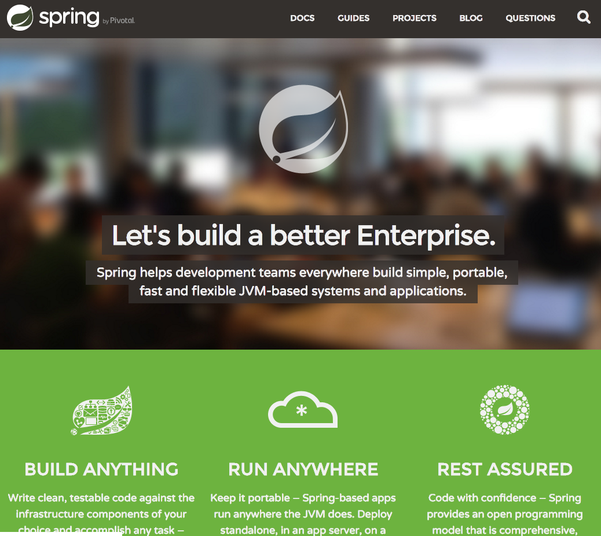
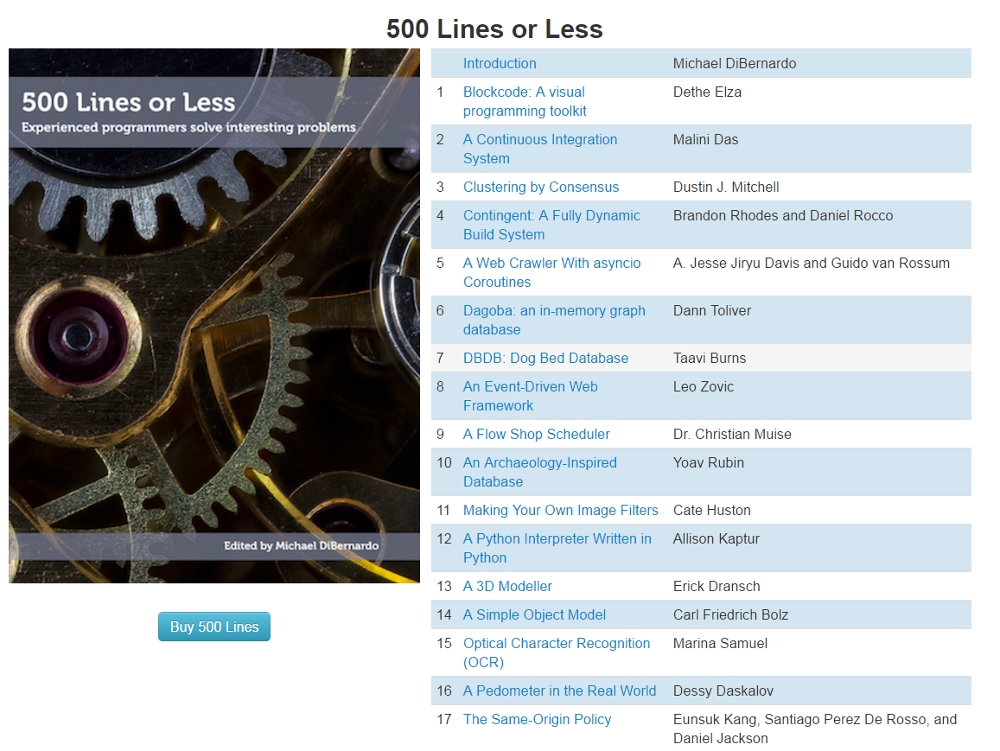
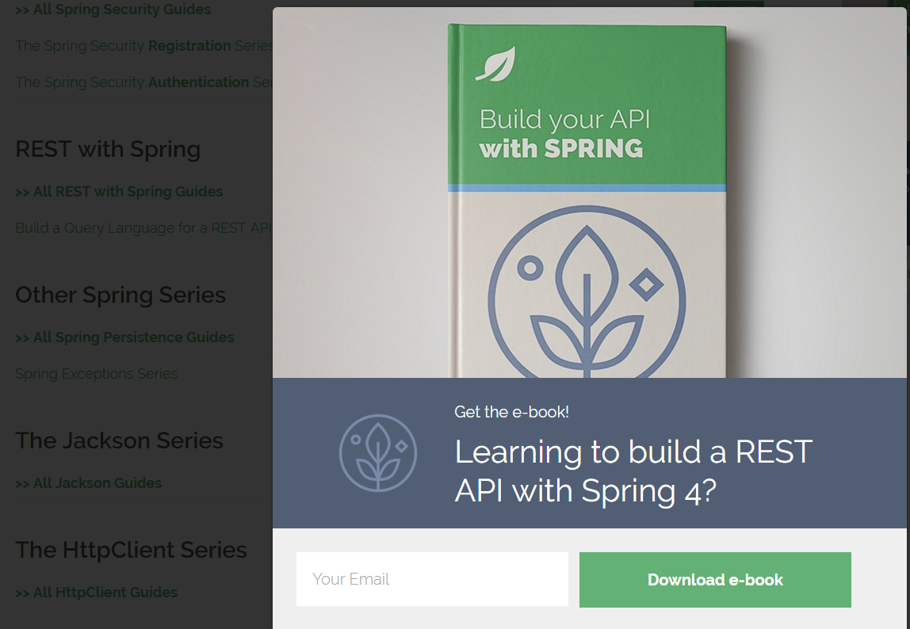
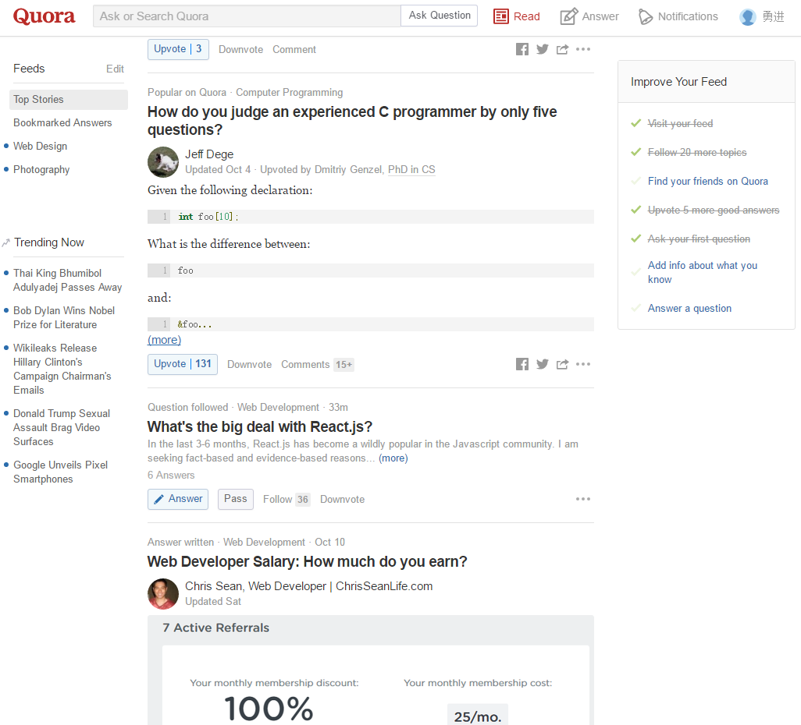

# 2017年秋招Java后台的学习与面试经验
从9月份开始参加校招, 到现在持续了快一个半月的时间, 尽管目前战绩是0 offer,不过既然互联网求职的寒冬已经来了, 春天还会远吗?大家一起加油!!!
心真的很累了, 被虐得不知道秋招什么时候才能结束, 真诚希望能在下周全部结束

在经历了这么多场面试后, 我觉得有以下经验是可以分享的:

1. **Java后台开发方向的同学千万千万不要把眼光仅仅局限于三层架构和后台框架, 而要把目光转向/分布式系统/大数据处理/多线程编程/数据库性能调优/编译原理等知识, 尤其是分布式系统，非常重要**， 尽管确实有点难以在项目中使用, 但了解总比没了解好(因为面试可能会问啊, 说多都是眼泪, 真的) 前沿技术那么多, 赶得上时髦才是硬道理
2. 实际上学习后台开发未必要从Java开始, 使用python或者NodeJs感觉入门更快一些(脚本语言拘束较少), Java入门web开发相对而言很重量级...但是自从有了spring boot后其实感觉没差, 或者学后台开发从spring boot开始也是可以的, 未必从坑死无数人的SSH(Struts2, Spring, Hibernate)下手
3. 后悔9月初懒得刷笔试题, 其实刷笔试题是能对掌握计算机基础知识有很大的帮助. 勿走前车之鉴, 我9月份投的所有企业只有网易是过了笔试的..
4. 在线编程题请锁定[leetcode](https://leetcode.com/)或者[lintcode](http://www.lintcode.com/zh-cn/)(lintcode有时候需要翻墙, 不过好处是题目是中文版)
5. 对简历上的每一个字负责, 而且最好简洁明朗, 拒绝啰嗦, 让面试官的所有问题都针对你的简历进行提问, 否则他要是用多年的工作经验碾压你就是分分钟的事了
6. 确实要看很多很多书, 但是当你懂得了看书的技巧后, 其实阅读的速度确实会越来越快的
7. "***所有你在书上看到的东西, 都是基础***."(出自某面试官) **做项目才是吸收知识的最好途径...作为工科类的学生, 面试官更注重的是你做出了什么, 而不是你知道什么**...
8. 对于程序员而言简历上的项目经验是非常重要的, 几乎所有面试官都会拿项目经验开始问你问题. 对于你简历的所有项目经验, 它们用到了哪些后台框架, 不仅要知其然, 还要知其所以然. 不要偷懒, 源码得读起来, 一问三不知的时候就真的醉了. 这方面推荐多看博客多看课外书籍
9. 不要因为懂得越多就越是持有谦卑的态度, 在面试官面前, 就是表现自己最好的一面, 做最好的自己, 就是干. 坚持就是胜利, 尽管它来之不易

(我一个0 offer的人扯这些鸭汤其实感觉蛮脸红的....)
下面列举一些我觉得对我来说非常有用的书单和网站, 还有推荐使用的工具, 仅供参考, 希望能帮助到跟我一样找工作的兄弟姐妹们, 还有尚未定位自己的师弟师妹. 以下所有书籍(网站)建议阅读, **不一定要读完, 但关键和核心得抓住**

## 计算机基础

### 《深入理解计算机系统》
著名的CSAPP, 这本书没有作为教材让我觉得很惊讶, 从c语言到汇编语言到硬件再到操作系统, 写得非常好. 虽然是本非常厚的砖头书, 而且看英文的效果比看中文更好, 但是是一本能帮助深入理解计算机系统的书. 基本上把这本书吃透面试操作系统的大部分问题都不是问题

### 《具体数学》:
读这本书的前提是大一的微积分, 高能预警. 其实对面试什么的并没有特别大的帮助, 但是如果想挑战思维的话可以看看, 因为很多解决问题的技巧确实蛮惊艳我的. 实际上我自己也没有看完, 但是会争取看下去

### 《算法导论(第三版)》
被很多acmer coder奉为学算法的经典之作, 尽管不太适合初学者, 因为它这本书很多内容只提供了伪代码, 而没有具体实现. 但是我建议还是从这本书学数据结构和算法最好, 因为日后的编程语言对实现实际上并没有特别大的障碍, 只是适合与不适合的选择罢了, 而把想法转换成编程语言才是对算法知识的考验. 如果不想太过深入的话可以忽略掉 第四部分(高级设计和分析技术) 第五部分(高级数据结构) 和 第七部分(算法问题选编), 你会发现书其实比你想象中薄很多噢!

### acm-cheet-sheet
如果你觉得看伪代码转换成编程语言这样的学习方式很吃力, 没关系, 这个pdf链接完全可以满足你的需求, 里面把很多常用的算法实现了(c/c++语言), 坚持临摹(注意不是死记硬背, 是临摹!)绝对能应对大多数公司的笔试编程题, 附上[pdf下载链接](https://github.com/soulmachine/acm-cheat-sheet)

### 《剑指offer》
你未来面试的很多手写代码题 源题库, 你还不看?

### 《STL源码剖析》
如果你是经常用c++刷算法题的同学, 那么一定经常用STL的各种集合, vector, set, stack, queue等等..它们的实现原理, 在源码面前, 了无秘密

### 《Linux命令行与shell脚本编程大全》
亚马逊书店五星推荐噢! 里面大概讲述了很多linux系统的使用和命令行等. linux是Java后台开发人员必知必会的操作系统, 而命令行是使用linux系统必须要面对的 对于不想装linux系统的同学其实可以考虑使用腾讯云学习一些linux相关的命令行知识(没错, 不需要图形界面), 学生价一个月才一块钱, 跟月饼厂一个月十块钱比起来也太划算了吧! 而且用linux也蛮酷的啊, 下面是我 联网+有道词典查单词 的操作...

### 《计算机网络: 自顶向下方法》
软件学院的计算机网络教材, 里面将计算机网络从顶层到底层逐章分析了一遍, 非常适合初学者阅读, 不过最好能够结合一些实验来辅助理解, 因为里面的讲解确实蛮抽象的

### 《图解HTTP》
日本人著的介绍HTTP协议的书, 对理解HTTP协议的一些细节有非常大的帮助, 插画也很多(日本人的行文风格, 感觉就像看漫画一样), 很容易就理解了

### 《TCP/IP详解卷一》
觉得上面两本讲解网络的还不够深入?我很钦佩这本书的作者, 能把枯燥的知识讲得那么那么那么细致, 非常强烈推荐这一本, 看完相应章节后大概能够明白为什么TCP/IP要这么设计了. 面试的时候经常问到三次握手和四次挥手, 还有各种状态的转移, TIME_WAIT的时间为什么是2*MSL...

### 《UNIX网络编程卷一: 套接字联网API(第三版)》
中文版快800页, 不过我只看了一些章节, 这本书也是把TCP/IP的细节讲得很深很深, 此外还有非常重要的基本套接字编程, 就是写网络程序的时候那些bind, accept, listen, send, receive函数之类的, 内容非常多, 但是这些是理解多路复用模型所需要掌握的...select/poll/epoll这些系统调用解决了什么问题? 事件机制能不能理解? 就看这本书的前六章了

### 《数据库管理系统(原理与设计)》
这个也是web开发中离不开的东西, 必须划重点学会的是ER图/SQL语句/存储数据(磁盘|文件|RAID|缓冲池等)/三大范式/索引以及相应的数据结构/事务相关的所有概念, 尤其重点学习SQL, 附上学习[链接](http://www.imooc.com/learn/122) .之后学会使用mysql workbench来进行数据库建模/逆向工程生成建表语句/根据SQL生成JAVA实体类等就不赘述了, 开发过程中百度谷歌一下就知道啦, 然后如果习惯在windows下开发的同学推荐利用navicat这个好东西, 当然如果说想训练自己写sql语句的能力那纯粹用命令行也无所谓...

### html/css/javascript
这个是做web开发基础中的基础, 个人感觉学习难度不大, 但是建议一口气学完并尝试利用它们做一个简单的个人简历, 否则学习曲线会比较断断续续, 不够一气呵成, 具体教程可以参考 [html/css](http://www.imooc.com/learn/9) [javascript入门](http://www.imooc.com/learn/36) [javascript进阶](http://www.imooc.com/learn/10) [Javascript深入浅出](http://www.imooc.com/learn/277)

### jQuery/Bootstrap/AngularJs
关于javascript, 其实纯粹使用原生javascript开发网站的话很麻烦, 所以就萌生出了这么一些框架: jQuery解决了浏览器兼容性的问题(虽然据说要过时了), Bootstrap可以很无脑地开发出看起来蛮好看的网页(其实还有很重要方面是响应式前端); 而AngularJS主要是有一个很重要的思想:MVVM, 随后崛起的vue.js也如出一辙而上手更快...**对于Java Web开发程序员而言建议刚开始有选择性地进行学习**, 可能真正涉猎深了就可以随意转换了. ps: 我的前端基本都是在[慕课网](http://www.imooc.com/)学成的, 我觉得这个网站真的业界良心. 去官网搜索吧!

### JS的原型链与闭包
可能利用上面框架开发的时候会遇到一些很棘手的问题不知道如何解决, 那么建议先看看王福朋的博客: [《深入理解javascript原型和闭包系列》](http://www.cnblogs.com/wangfupeng1988/p/4001284.html), 我觉得看完理解了以后定位js的bug应该会更容易一些

### SublimeText
一个对于前端开发工程师来说非常强大的编辑器, 可以提供各种各样的自动补全(必会emmet插件语法), 附上教程 [快乐的sublime编辑器](http://www.imooc.com/learn/333) 和 [前端开发工具技巧介绍—Sublime篇](http://www.imooc.com/learn/40). 自从用了SublimeText, 我再也不畏惧前端编程了...如果觉得教程看得不过瘾, 知乎上这几个帖子可以让你领略SublimeText的[奇淫技巧](https://www.zhihu.com/question/24896283?rf=19976788)

### WebStorm
Jetbrain旗下的[前端IDE](https://www.jetbrains.com/webstorm/), 我觉得相比SublimeText它更好的一点就是不需要你自己去装插件就已经有了很多方便的功能, 上手比SublimeText快

### VSCODE
微软开源的编辑器, 知乎上也有比较详细的[讨论](https://www.zhihu.com/question/29984607). 个人认为好看/高雅/好用, 如果习惯SublimeText入手vscode并不难, 反正我现在已经转战VSCODE了, 就因为它可以设置背景为萌萝莉喔, 是不是蛮可爱的, 感觉打代码更有精神了

### Github
将[github](https://github.com/)列为基础可以足以说明它的重要性, 其实主要是理解版本控制与分支协作的概念, 不过使用这个网站之前得先学git, [廖雪峰的博客](http://www.liaoxuefeng.com/wiki/0013739516305929606dd18361248578c67b8067c8c017b000 )就介绍得非常到位. 建议刚入门github的时候可以将github当成成云仓库(你甚至可以把东京热的种子放在github里哈哈哈), 熟悉一些基本命令. 到后面团队作业的时候强制使用github进行协同合作, 会渐渐发现和理解github的好处的. 除此之外github还是一个搜索开源优质项目的好网站

## Java

### 《疯狂Java讲义》
个人认为Java入门最好的书籍. 这本书比什么《Java编程思想》好理解得多, 可能是因为翻译者水平堪忧吧, 反正Thinking in java是真的看不下去, 知乎上那些推荐Thinking in java入门的程序员真是有毒...然后对于这本书而言, **除了图形界面编程以外, 其他内容最好认真读完并实践一遍, 会对理解Java Web有不少的帮助**

### 《Effective Java》
建议有一定项目经验的人才去看这本书, 里面列举了很多开发必须注意的条目. 说实话这本书真的不那么好看, 但是你会发现在某些笔试题上会出现这本书的很多条目

### Intellij IDEA
学习Java怎么能不知道有这么个牛逼轰轰的IDE!  可以说彻底提升了我的开发效率, 简直相见恨晚, 在所有教程中我觉得极客学院做得最为认真, 附上极客学院的[学习地址](http://wiki.jikexueyuan.com/project/intellij-idea-tutorial/first-run-wizard.html)

### Maven
为什么我把Maven放在这里? 因为它蛮重要的(其实用gradle也可以). 一个解决java web项目开发中所需要的依赖问题, 同样论工具的使用教程, 极客学院最给力, 附上[教程地址](http://wiki.jikexueyuan.com/project/maven/pom.html)

### 《轻量级Java EE企业应用实战》
(阅读此书时建议把基础部分的全部搞定,)这本书跟《疯狂Java讲义》是配套的, 里面先讲解Servlet/Jsp(Java Server Page)等技术, 然后就是SSH(Struts/Spring/Hibernate)等后台框架的各种使用, 其实说白了就是把这些技术的官方文档给翻译一遍给你而已. 有人觉得struts2都过时了还有没有学习的必要? 我认为理解一下也不会花太长时间, 因为学习任何框架的重点也不仅仅是用而已. 初学者把重点放在一些思想上的东西(尽管很虚, 但是后续的框架基本都会延续这些思想), 比如控制翻转IoC|面向切面编程AOP|对象关系映射ORM|模型-视图-控制器MVC等, 把这些弄懂后之后的SpringMVC, mybatis等后台框架上手会很快的. 这些东西真的太太太太太太基础了, 搞不懂就要考虑转行了(= . =) 另外看这本书入门Java web的时候不要对作者那种用记事本编程的方式太较真, 会debug到天昏地暗的, 使用Intellij Idea就好了(如果不懂使用Intellij Idea可以先去慕课网或极客学院或csdn等网站看看别人是怎么操作的即可). 还有想说的就是, 请务必学会使用maven, 手工导jar包学习Java Web的方式简直就是弱智行为, 而我居然坚持了三个月..最后, **把这本书当成工具书比较合适: 初次阅读理解就好没必要动手实践, 等到需要的时候再翻阅查询**

### 《Spring Boot实战》
还在用xml配置各种依赖注入/数据源/事务管理器? out啦! 随着微应用的流行, 以注解替代xml配置的开发方式将越来越流行. 作者汪云飞没有讲太多废话, 内容基本都是说Spring Boot的某个特性然后举个例子实战, 有利用SSH开发过简单项目的同学可以尝尝先(我去实习的岗位早就开始用了, 觉得蛮新颖的) 实际上学习任何一个框架的时候要先了解这个框架解决了什么问题, 只有理解了这个后才能更有针对性也更有效率地去进行学习

### 《Head First 设计模式》
隆重推荐这本神书, 很有趣. 刚开始读觉得很深, 但是和《轻量级Java EE企业应用实战》一起看, 思考那些设计模式存在的意义, 会对软件架构方面的知识豁然开朗...

### 《两周自制脚本语言》
 一本用Java教你开发脚本语言的教材, 实际上可以把它当做编译原理的正课来学习. 我之前以为编译原理不重要, 没有认真学, 结果阿里面试官问了我Json字符串如何转换成一个对象我就懵逼了. : 你知道编译原理的重要性了吗? 一个问题答不好可能就断送了你的求职生涯啊! 不止是简单的词法分析和语法分析, 重排序等编译器的性能优化方式也最好能理解一番

### 《Java并发编程实践》
又是个歪果仁写的书, 里面详细介绍了Java并发工具包java.util.concurrent的各种工具以及很多的并发编程实践之道, 是并发编程的入门之作.

### 《Java并发编程的艺术》
国人写的书, 也是写Java并发编程的, 与上一本相比个人认为比较凝练/干净/易懂

## Java进阶

### 《架构探险: 从零开始写Java Web框架》
作者叫黄勇, 一本非常让我拍手叫绝的书....首推! 绝对干货! 如果你不想看spring源码也没有太大关系, 这本书带你一步步地开发出一个类似spring mvc的简单框架, 并且逐步地增加需求和完善, 理解了每个细节对于理解Java Web的开发是很有帮助的

### 《深入分析Java Web技术内幕》
这本书我觉得是必看的, 可以说是对我帮助最大的一本技术书籍, 覆盖了Java Web很多方面的知识, 比如计算机网络|Tomcat结构|Spring架构|SpringMVC原理|模板引擎实现原理等, 绝对很有收货, 足够有深度也很有难度

### 《Spring源码深度剖析》
一本比较详细的书, 其实对于阅读源代码, 跟着作者的思路读, 再结合自己的断点调试进行学习的方式是最好的

### 《深入理解Java虚拟机-(JVM高级特性与最佳实践)》
想知道Java虚拟机为什么会帮你自动收集垃圾而不需要你管理资源释放吗?  想知道Java虚拟机的内存区域是如何划分的吗? 想知道Java虚拟机是如何唯一确定一个Java实现类, 并且如何加载类的吗? 想知道JVM凭什么能够将远程服务器发送的网络字节加载到JVM内存, 从而实现远程过程调用的吗? 这本书你值得拥有!(感谢这本书让我回答出RPC的实现原理)

### 500 lines or less
500行代码! 尽管跟Java没有太大关系, 强烈推荐, 里面的程序主要是一些玩具轮子, 都是用python实现的, 学习这个主要是理解别的程序员在开发软件的时候所做的决策/思路/取舍, 虽然我也没看完, 但是觉得这个资源很赞!!! [官方网址](http://aosabook.org/en/index.html)

### 《MySQL技术内幕-InnoDB存储引擎》
其实讲道理这种书应该给DBA看才对, 不知道为什么Java Web开发也要看- - 有次面试就问到说对mysql数据库的性能调优有什么看法, 所以就列在上面. 不过说真的有点晦涩难懂, 如果想简单粗暴地应付面试的话就看[这个博客](http://blog.codinglabs.org/articles/theory-of-mysql-index.html) 这篇博客应该是我目前看到的对于mysql索引的解释最最通俗易懂的了

## 分布式系统

### 《大型网站技术架构: 核心原理与案例分析》
李智慧著, 确实是很好的入门书籍. 实际上如果有操作系统和Web项目后台开发的基础话阅读起来不会特别困难, 主要内容是介绍当今企业应对大型网站高并发请求的种种策略

### 《分布式Java应用-基础与实践》
这本书比较深, 介绍分布式Java应用和相应的应用场景, 什么远程过程调用(RPC)呀, 基于服务的体系架构呀(SOA)等, 同时也讲了很多java比较底层的知识, 最后介绍构建高可用/可伸缩系统的工程经验

### 《大型分布式网站架构: 设计与实践》
与上一本书类似, 不过个人觉得更偏向于"介绍"互联网安全架构和分布式系统的各种组件(比如分布式缓存|消息队列|搜索引擎等), 目前我只接触了Redis, 相应的组件实在太多了- - 此外对系统监控和数据分析等也做了相应介绍, 这些我感觉比较偏向运维岗的工作人员

### 《Redis实战》
Redis的基本用法和在生产环境的应用, 值得拥有, 虽然书籍是用python, 不过[官方github也有放java的源码](https://github.com/josiahcarlson/redis-in-action)

### 《Redis设计与实现》
Redis的源码解读, 怎么说呢, 反正比spring源码好读太多了....而且作者读得很用心, 整理出了带注释版本的redis源码, [去读个痛快吧少年](https://github.com/huangz1990/redis-3.0-annotated)

## 博客与网站

### 博客
这里再着重推荐两个大神的博客, 都是歪果仁
+ [Jenkov](http://tutorials.jenkov.com/): 丹麦资深Java开发人员, 从事软件开发十多年, 如果你觉得李刚的教材看腻了, 可以看看他写的教程, 非常适合初学者, 发现知乎很多Java程序员都是在这里学并发编程的

+ [Baeldung](http://www.baeldung.com/): 这系列教程是我觉得讲spring的用法讲得最好最全的.. 尤其是讲spring security讲得真的很详细...

此外还有一些常用的学习网站:
+ [**慕课网**](http://www.imooc.com/): 首推, 自己真心感谢这个网站
+ [**实验楼**](https://www.shiyanlou.com): 地位和慕课网相当, 让我觉得编程有趣的一个学习网站
+ [**天码营**](https://course.tianmaying.com): 里面有很多Java项目值得临摹
+ [**掘   金**](http://gold.xitu.io/): 一个致力于为广大程序员推送文章的app(PC端也能看), 干货不少
+ [**知   乎**](https://www.zhihu.com/): 关注几个大v带逛, 会拓展不少视野, 列举一些我觉得不错的用户名(括号表示补充说明): 车小胖(计算机网络相关知识), 灵剑(清华数学解题高手, 可以去看看它对于数学题的解决方式, 很受用), 美团点评技术团队(目前看不是很懂, 讲述的是它), RednaxelaFX(这个大v的研究领域有点深, 但是认真看对理解Java虚拟机是有帮助的),auxten(面向工资编程, 真的是2333333, 我主要是看他写的文章), 陈硕(网络编程专家, 对于TCP/IP|socket编程的很多问题都比较热心), vczh(轮子哥, 拥有轮带逛的膜法)
+ [**coursera**](https://zh.coursera.org/): 这个不多解释了, 如果想跟国际接轨(英语授课)的话这个网站很适合你, 里面有很多全世界优质的课程,  知乎上也有总结得很详细的课程列表, 适用于任何人(https://www.zhihu.com/question/22436320)
+ [**Quora**]: 知乎的鼻祖, 但是抖机灵的人比较少, 外国牛人也是很多的, [上了才知道](https://www.quora.com/)

实际上很多同学可能对项目经验比较头疼, 不知道做什么, 我提供一个简单的思路

做个人博客|简历, 输入账号密码进行校验(登录注册太基本了), 之后就是对文章|简历的增删查改操作, 后台三层架构(控制层/服务层/数据对象层), 部署到云服务器上, 这就是你的博客|简历v1.0了

v2.0就可以考虑多终端, 将服务层从原来的单机抽离出来, 利用hession框架(或者其他RPC框架)让控制层和服务层服务器进行网络通信, 从而实现将应用服务部署在独立的服务器, 这样假如要面向多终端, 比如现在微信小程序就可以多编写一个控制层应用, 使用REST风格URL, 与之前思路类似调用统一服务平台的服务, 这样就是一个非常简单的分布式应用吧

之后的版本再慢慢尝试redis, mongodb之类的分布式组件, 虽然我自己还没有实践过, 不过应该是可行的. 驱动性的做项目的效率和学到的东西还是很高的.

最后呢, 小弟在这里列举了一些个人在面试的时候遇到的面试问题, 希望能够对后续的求职者有所帮助, 祝愿大家成为offer收割机!

**附录**:
+ 阿里巴巴Java开发工程师 内推一面
    1. 说说你的项目
    2. 你的项目用了gson, 有没有看过它的源码? 如果给你一个json字符串, 你要怎么把它变成一个java对象?
    3. 多线程的理解
    4. 集合框架的理解
    5. 平衡二叉搜索树的理解

+ 阿里巴巴Java开发工程师 实习一面
    1. 看过spring源码吗? 说说IoC和AOP的概念以及源码实现
    2. Java垃圾回收机制
    3. JVM内存模型
    4. linux命令: 如何查询哪些端口被占用
    5. 三次握手/四次挥手机制
    6. mysql索引的理解

+ 腾讯后台开发工程师 实习一面
    1. 线程和进程的区别
    2. 静态变量和全局变量的区别
    3. c++的虚函数表
    4. 三次握手/四次挥手
    5. TCP洪水攻击
    6. 实现单链表翻转算法

+ 网易互联网Java开发工程师 一面
    1. Session的实现原理和应用场景
    2. 对Java的集合框架有什么样的了解, 用过哪些集合类, 各自的效率以及适用场景
    3. Java的异常处理机制, 说说受检异常和运行时异常的区别并举例
    4. MySql索引作用; SQL语句的5个连接概念
    5. 列举出你拿得出手的所有项目并说说你在其中的职责
    6. 说说你在做项目的过程中通过引入新的观念从而解决难题的事例
    7. 举出你在开发过程中遇到的原先不知道的bug, 通过各种方式定位bug并最终成功解决的例子

+ 欢聚时代Java开发工程师 一面
    1. 一个分布式系统中, 本地函数 int getTradingAverage(int[] uids)表示传入一个用户id数组用于求用户消费的平均值, 远程服务器提供了接口: int getTrading(int uid)表示查询用户uid的消费金额, 请利用远程服务编程实现高效的本地函数.
    2. 大型论坛网站难免会出现敏感评论, 如何过滤敏感评论
    3. 说说你的项目
    4. 实习过程的redis集群方案调研具体是什么情况
    5. Session原理; 既然Session是存储在服务器内存的, 如果服务器的负载量很高内存负荷不住要怎么办?
    6. 用户登录功能是怎么实现的?你这样实现没有考虑各种安全问题(跨站访问, SQL注入等), 如果考虑了呢?

+ 华为互联网开发 一面
    1. 说说Spring MVC框架是怎么实现的
    2. 简要介绍你做过的项目
    3. 给定一个数组, 里面放置任意数量的随机数, 如何快速统计出数组中重复的数字以及出现次数
    4. AVL树的概念, 四种旋转方式, AVL树左右旋转的例子
+ 华为互联网开发 二面
    1. 谈谈你做的项目, 具体说一下
    2. 有带成绩单过来吗?你的成绩在学院什么水平?
    3. 你对华为有什么样的了解?
    4. 身边有人在华为吗?他的反馈如何?
    5. 你住在哪里?期望工作地在哪里?

+ 微众银行后台开发(Java) 一面
    1. 说说你做过的项目
    2. 在实习过程中的分布式系统是怎么样的, 画图示意
    3. Tomcat的源代码有了解吗?说说它的组织架构
    4. Java的反射是基于怎样的原理?
    5. RPC远程过程调用是基于怎样的原理?在你的实习项目中是怎么一种形式体现?
    6. 有了解过大数据吗?谈谈hadoop的map-reduce以及你对它的理解
    7. 实习期间的Redis集群方案
    8. 你家乡在哪里?离深圳近吗?
+ 微众银行后台开发(Java) 二面
    1. QQ每天都会产生大量的在线日志记录, 假设每天的在线日志记录有十亿条, 请设计一个算法快速找出今天的在线人数
    2. 给定字母集合(a-z), 求出由集合中这些字母组成的所有非空子集
    3. 32位系统的内存寻址空间多大, 具体分为哪几种形态?库函数和系统调用有什么区别?
    4. 说说操作系统内一个进程的内存分段以及对应的作用
    5. c++的set底层是什么数据结构的?(面试官以为用哈希表实现, 被我指正为红黑树了)
    6. 举出一个例子说明你的自学能力
    7. 在实习过程中遇到的难题以及解决方式
    8. 如果团队中有人心情不好, 如何进行沟通?
    9. 从实习过程中感受到了工作中哪些方面是很重要的?
